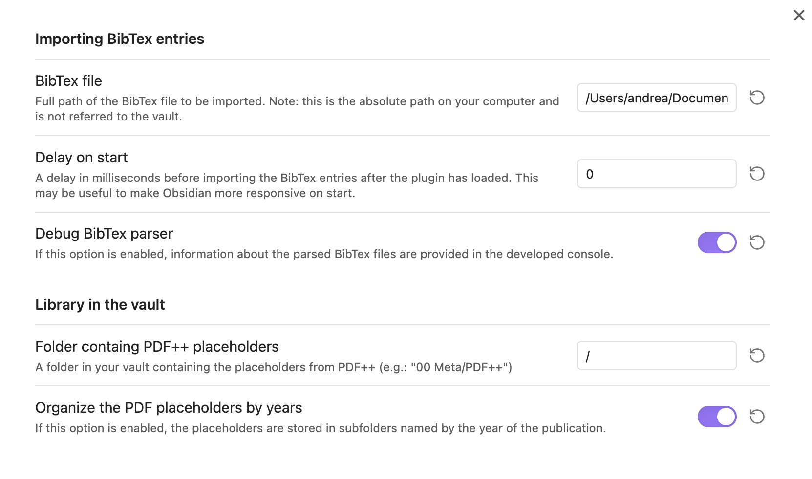
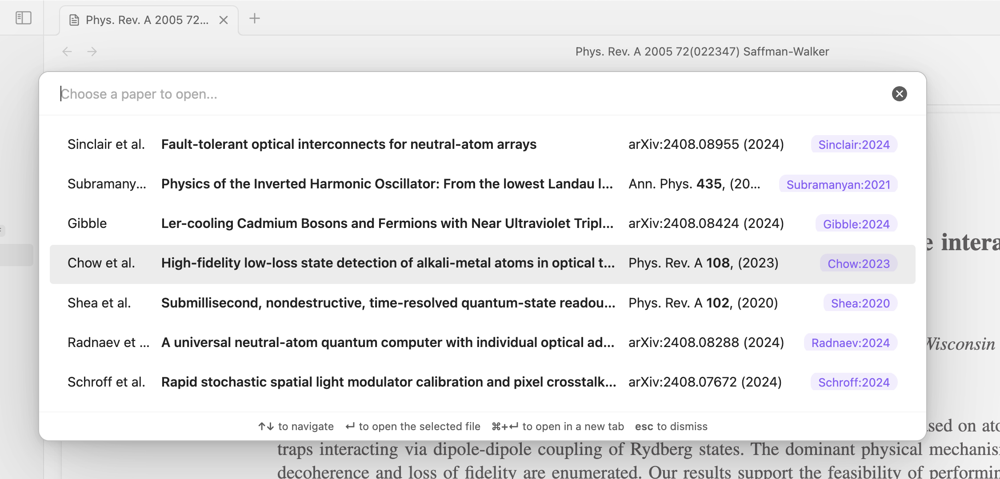

# Obsidian Bibdesk Integration

The plugin provides integration of the macOS [BibDesk](https://en.wikipedia.org/wiki/BibDesk) application with the [PDF++](https://github.com/RyotaUshio/obsidian-pdf-plus) plugin for Obsidian. The plugin relies on a BibTex file for the paper library. 

The plugin is able to parse the `bdsk-file-XYZ` fields created by BibDesks in the BibTex library. The strength of BibDesks `bdsk-file-XYZ` links is that they are macOS bookmarks that will resolve to the correct file even if the file is later renamed or moved.

The plugin does not require the paper library to be stored in the vault. This is especially important for those who have a large paper library of several GB and do not intend to use space in Obsidian's vault.

## Donations

I would be grateful for any donation to support the development of this plugin.

## Author

- **Author:** Andrea Alberti
- **GitHub Profile:** [alberti42](https://github.com/alberti42)
- **Donations:** 

Feel free to contribute to the development of this plugin or report any issues in the [GitHub repository](https://github.com/alberti42/obsidian-plugins-annotations/issues).
